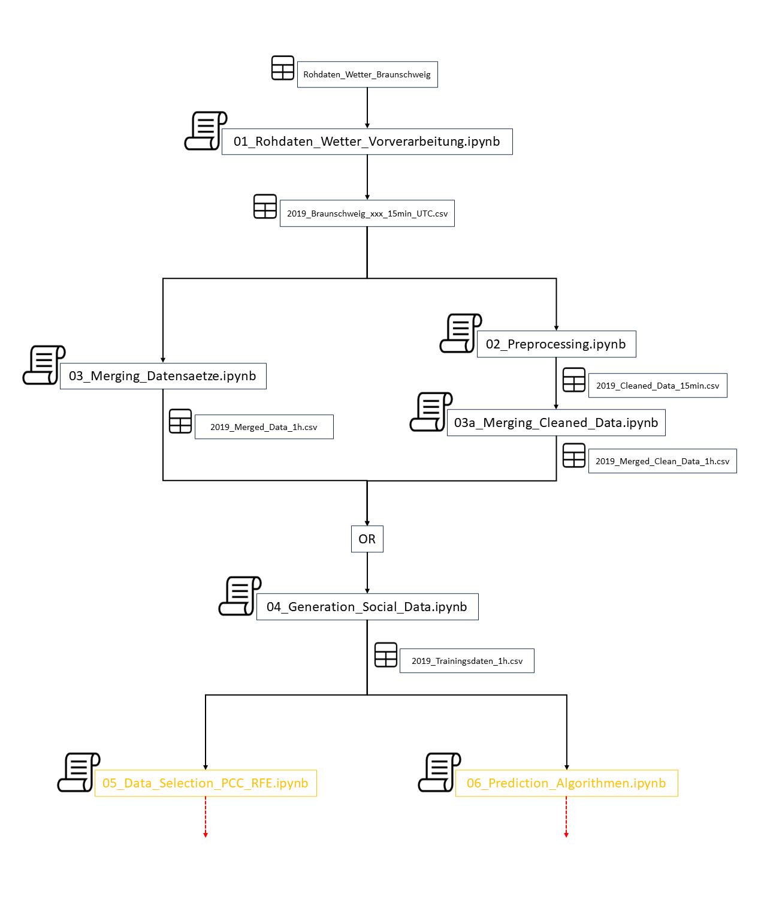

Related publications: 

[Co-simulation-based analysis of the grid capacity for electric vehicles in districts: the case of “Am Ölper Berge” in Lower Saxony](https://doi.org/10.1049/icp.2022.2713)
[An Open Source Grid Observer for the Analysis of Power Flexibilities in Low Voltage Distribution Grid Simulations](https://doi.org/10.1109/ICSGCE55997.2022.9953716)

